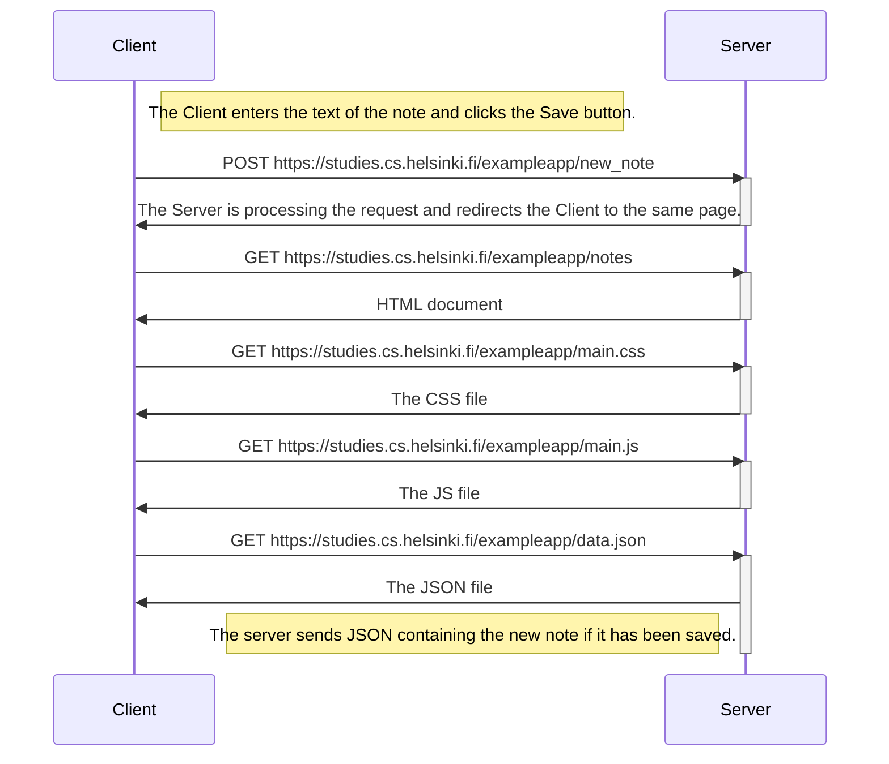

```mermaid
sequenceDiagram
    participant Client
    participant Server

    Note right of Client: The Client enters the text of the note and clicks the Save button.
    Client->>Server: POST https://studies.cs.helsinki.fi/exampleapp/new_note
    activate Server
    Server->>Client: The Server is processing the request and redirects the Client to the same page.
    deactivate Server

    Client->>Server: GET https://studies.cs.helsinki.fi/exampleapp/notes
    activate Server
    Server->>Client: HTML document
    deactivate Server

    Client->>Server: GET https://studies.cs.helsinki.fi/exampleapp/main.css
    activate Server
    Server->>Client: The CSS file
    deactivate Server

    Client->>Server: GET https://studies.cs.helsinki.fi/exampleapp/main.js
    activate Server
    Server->>Client: The JS file
    deactivate Server

    Client->>Server: GET https://studies.cs.helsinki.fi/exampleapp/data.json
    activate Server
    Server->>Client: The JSON file
    Note left of Server: The server sends JSON containing the new note if it has been saved.
    deactivate Server
```