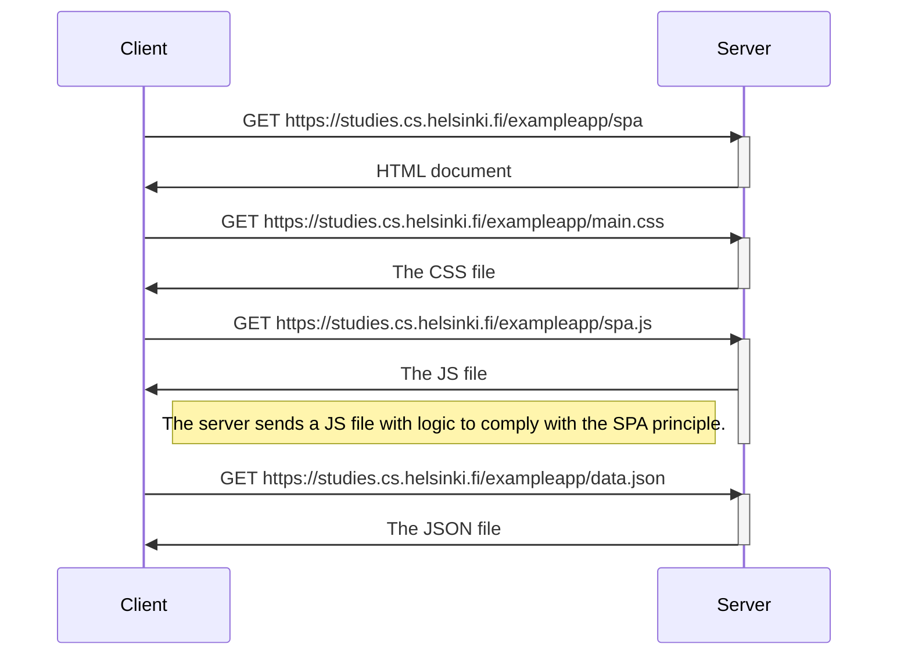

```mermaid
sequenceDiagram
    participant Client
    participant Server

    Client->>Server: GET https://studies.cs.helsinki.fi/exampleapp/spa
    activate Server
    Server->>Client: HTML document
    deactivate Server

    Client->>Server: GET https://studies.cs.helsinki.fi/exampleapp/main.css
    activate Server
    Server->>Client: The CSS file
    deactivate Server

    Client->>Server: GET https://studies.cs.helsinki.fi/exampleapp/spa.js
    activate Server
    Server->>Client: The JS file
    Note left of Server: The server sends a JS file with logic to comply with the SPA principle.
    deactivate Server

    Client->>Server: GET https://studies.cs.helsinki.fi/exampleapp/data.json
    activate Server
    Server->>Client: The JSON file
    deactivate Server
```