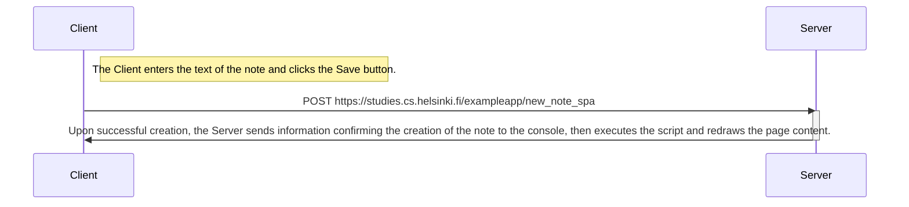

```mermaid
sequenceDiagram
    participant Client
    participant Server

    Note right of Client: The Client enters the text of the note and clicks the Save button.
    Client->>Server: POST https://studies.cs.helsinki.fi/exampleapp/new_note_spa
    activate Server
    Server->>Client: Upon successful creation, the Server sends information confirming the creation of the note to the console, then executes the script and redraws the page content.
    deactivate Server
```